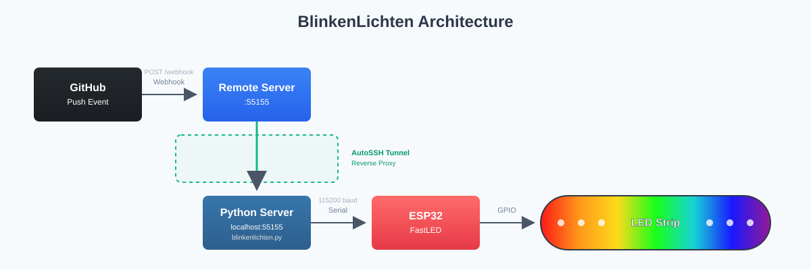

# BlinkenLichten

> ESP32-controlled LED strip with a Python HTTP bridge, webhook-driven effects, and a minimalist web UI.

BlinkenLichten lets you control an addressable LED strip attached to an ESP32 using simple serial commands. A Python webserver exposes HTTP endpoints (and a basic HTML page) and reacts to GitHub push webhooks: if every commit message follows the Conventional Commits specification you get a celebratory rainbow; if any commit breaks the rules the strip flashes red.


## 1. Overview & architecture

- ESP32 runs the sketch in `src/main.cpp` (FastLED + EEPROM persistence).
- Host machine runs `blinkenlichten/blinkenlichten.py` bridging HTTP → Serial.
- Browser UI served at `/` allows manual triggering.
- GitHub sends push events → server validates signature & commit messages → selects effect.




If pyserial is missing the server degrades to a dry‑run mode (logs commands, no hardware calls).

---

## 2. ESP32 firmware (PlatformIO)

Location: `src/main.cpp`. Key features:
- FastLED with RGBW emulation.
- EEPROM storage of last brightness (0–100) at address 0.
- Effects: Rainbow snake, Flash Red, Warm White, Shutdown.
- Serial baud: 115200.

Build & upload (USB connected):
```zsh
pio run -t upload
```
Or use the PlatformIO VS Code UI ("Upload").

Monitor serial output:
```zsh
pio device monitor -b 115200
```

---

## 3. Serial command protocol

Commands are ASCII lines ending with `\n`:

| Command | Value | Description |
|---------|-------|-------------|
| `brightness <0-100>` | 0–100 | Set warm white brightness & persist to EEPROM |
| `rainbow <ms>` | duration (0 → 5000 default) | Run rainbow snake then restore brightness |
| `flashred <ms>` | duration (0 → 5000 default) | Flash red pattern then restore brightness |
| `shutdown 0` / `off` | 0 | Turn all LEDs off |
| `on 0` / `on <0-100>` | brightness | Turn on & restore / set brightness |

The Python bridge sends exactly these strings followed by `\n`.

---

## 4. Python webserver

File: `blinkenlichten/blinkenlichten.py`

Start (defaults: port 55155, device `/dev/cu.usbserial-0001`):
```zsh
uv run blinkenlichten.py
# or
python blinkenlichten/blinkenlichten.py
```
Custom port/device:
```zsh
uv run blinkenlichten.py 55155 /dev/cu.usbserial-0001
```

### Endpoints
| Method | Path | Query | Purpose |
|--------|------|-------|---------|
| GET | `/` | - | Serve simple HTML control page |
| GET/POST | `/rainbow` | `duration=<ms>` | Trigger rainbow effect |
| POST | `/flashred` | `duration=<ms>` | Trigger flash red effect |
| POST | `/on` | - | Turn lights on (restore EEPROM brightness) |
| POST | `/off` / `/shutdown` | - | Turn lights off |
| POST | `/brightness` | `brightness=<0-100>` | Set brightness |
| POST | `/webhook` | - | GitHub push webhook (signature + commit checks) |
| GET | `/webhook` | `payload=<json>` | Testing webhook logic (no signature) |

### Webhook logic
- Signature: `X-Hub-Signature-256 = 'sha256=' + HMAC_SHA256(raw_body, WEBHOOK_SECRET)`
- Payload formats supported:
    - `application/json` (raw body is JSON)
    - `application/x-www-form-urlencoded` (JSON under `payload` form field)
- Commit validation: each commit's first line must match Conventional Commits pattern: `type(scope)?: description` with allowed types: `feat, fix, chore, docs, style, refactor, perf, test, build, ci, revert`.
- Result mapping:
    - All commits valid → `rainbow 5000`
    - Any invalid → `flashred 5000`

Set secret (zsh/macOS):
```zsh
export WEBHOOK_SECRET="your-shared-secret"
uv run blinkenlichten.py
```

---

## 5. Installation & running

### Requirements
- Python 3.10+
- PlatformIO (ESP32 build/upload)
- `pyserial` (recommended for real hardware) → install with `pip install pyserial`

### Using uv (recommended)
```zsh
uv sync
uv run blinkenlichten.py
```

Visit: http://localhost:55155/


---

## 6. SSH reverse tunnel exposure

Needed when GitHub cannot reach your local machine directly (NAT/firewall).

Ensure on the remote host's `sshd_config`:
```
GatewayPorts yes
```
Reload sshd if changed.

Create tunnel:
```zsh
ssh -N -R 0.0.0.0:55155:localhost:55155 user@remote.example.org
```
GitHub webhook URL becomes: `http://remote.example.org:55155/webhook`

Persistent tunnel with autossh:
```zsh
autossh -M 0 -N -o "ServerAliveInterval 30" -o "ServerAliveCountMax 3" -R 0.0.0.0:55155:localhost:55155 user@remote.example.org
```


## License
Add license information here (e.g., MIT) if desired.


